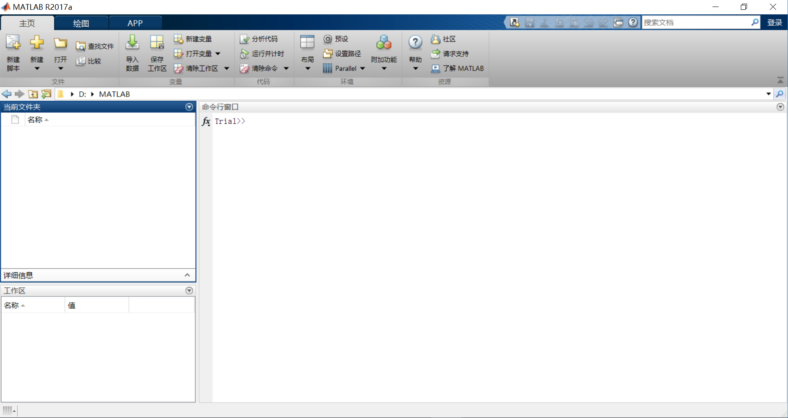
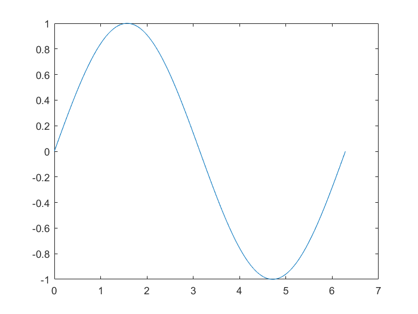
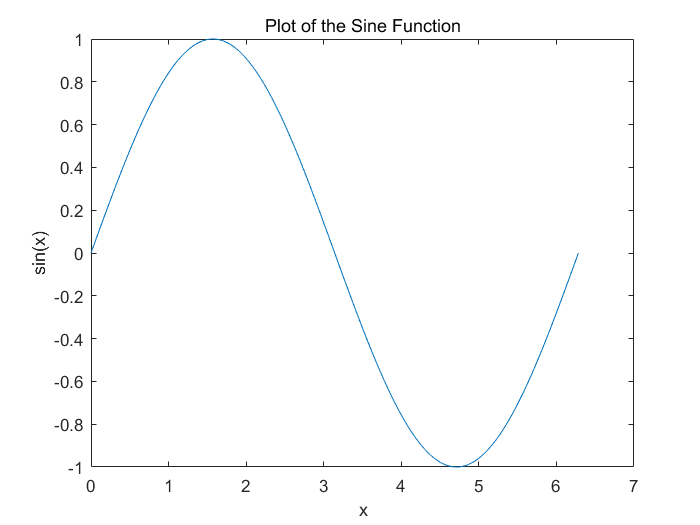
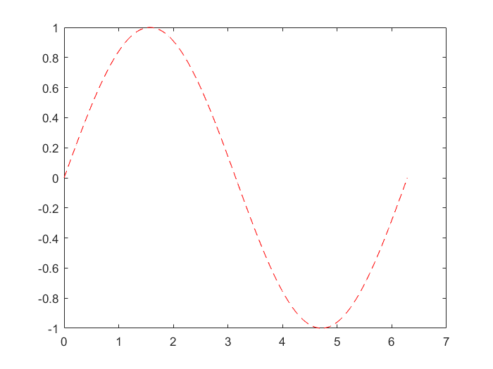
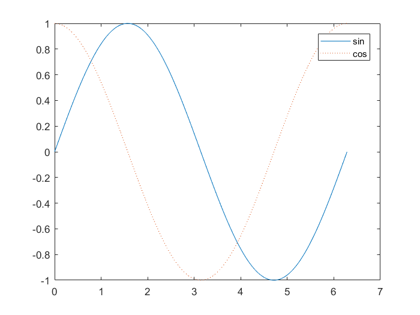
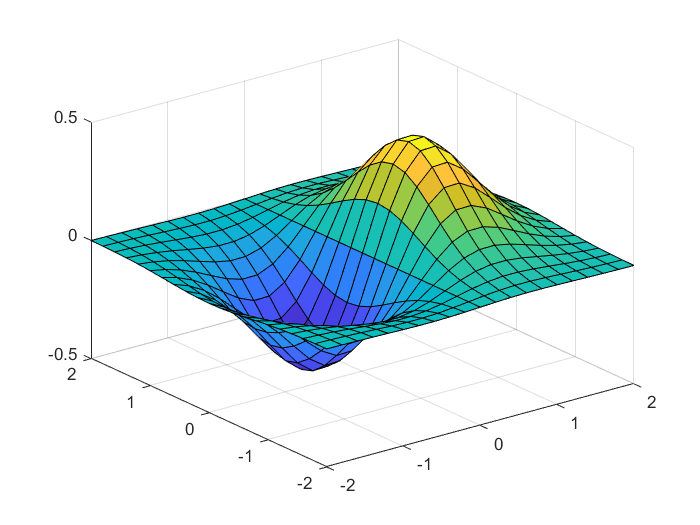
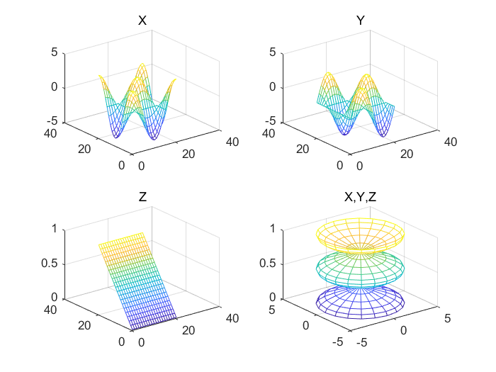

## MATLAB快速入门


#### 桌面基础知识
启动 MATLAB时，桌面会以默认布局显示。

桌面包括下列面板：
+ 当前文件夹 - 访问您的文件。
+ 命令行窗口 - 在命令行中输入命令（由提示符 (>>) 表示）。
+ 工作区 - 浏览您创建或从文件导入的数据。

使用 MATLAB 时，可发出创建变量和调用函数的命令。例如，在命令行中键入以下语句来创建名为 a 的变量：
```MATLAB
>> a = 1
```
MATLAB 将变量 a 添加到工作区，并在命令行窗口中显示结果。
```
a =
     1
```
创建更多变量。
```MATLAB
>> b = 2
```
```
b =
     2
```
```MATLAB
>> c = a + b
```
```
c =
     3
```
```MATLAB
>> d = cos(a)
```
```
d =
    0.5403
```
如果未指定输出变量，MATLAB 将使用变量 ans（answer 的缩略形式）来存储计算结果。
```MATLAB
>> sin(a)
```
ans =
    0.8415
``
如果语句以分号结束，MATLAB 会执行计算，但不在命令行窗口中显示输出。
```MATLAB
>> e = a*b;
```
按向上 (↑) 和向下箭头键 (↓) 可以重新调用以前的命令。在空白命令行中或在键入命令的前几个字符之后按箭头键。例如，要重新调用命令 b = 2，请键入 b，然后按向上箭头键。


#### 数组创建
MATLAB 是“matrix laboratory”的缩写形式。MATLAB主要用于处理整个的矩阵和数组，而其他编程语言大多逐个处理数值。所有 MATLAB 变量都是多维数组，与数据类型无关。矩阵是指通常用来进行线性代数运算的二维数组。
要创建每行包含四个元素的数组，请使用逗号 (`,`) 或空格分隔各元素。
```MATLAB
>> a = [1 2 3 4]
```
```
a =
     1     2     3     4
```
这种数组为**行矢量**。要创建包含多行的矩阵，请使用分号分隔各行。
```MATLAB
>> a = [1,2,3;4,5,6;7,8,9]
```
```
a =
     1     2     3
     4     5     6
     7     8     9
```

创建矩阵的另一种方法是使用 ones、zeros 或 rand 等函数。例如，创建一个由零组成的 5×1 列矢量。
```MATLAB
>> z = zeros(5,1)
```
```
z =
     0
     0
     0
     0
     0
```


#### 矩阵和数组运算
MATLAB 允许您使用单一的算术运算符或函数来处理矩阵中的所有值。
```MATLAB
>> a + 10
```
```
ans =
    11    12    13
    14    15    16
    17    18    19
```
```MATLAB
>>sin(a)
```
```
ans =
    0.8415    0.9093    0.1411
    -0.7568   -0.9589   -0.2794
    0.6570    0.9894    0.4121
```
要转置矩阵，请使用单引号 (')：
```MATLAB
>>a'
```
```
ans =
     1     4     7
     2     5     8
     3     6     9
```
可以使用 * 运算符执行标准矩阵乘法，这将计算行与列之间的内积。例如，确认矩阵乘以其逆矩阵可返回单位矩阵：
```MATLAB
>> p = a*inv(a)
```
```
p =

    1.0000         0   -0.0000
         0    1.0000         0
         0         0    1.0000
```
请注意，p 不是整数值矩阵。MATLAB 将数字存储为浮点值，算术运算可以区分实际值与其浮点表示之间的细微差别。使用 format 命令可以显示更多小数位数：
```MATLAB
>> format long
>> p = a*inv(a)
```
```
p =
    1.000000000000000                   0  -0.000000000000000
                    0   1.000000000000000                   0
                    0                   0   0.999999999999998
```
使用以下命令将显示内容重置为更短格式
```MATLAB
>> format short
```
format 仅影响数字显示，而不影响 MATLAB 对数字的计算或保存方式。
要执行元素级乘法（而非矩阵乘法），请使用 .* 运算符：
```MATLAB
>> p = a.*a
```
```
p =
     1     4     9
    16    25    36
    49    64    81
```
乘法、除法和幂的矩阵运算符分别具有执行元素级运算的对应数组运算符。例如，计算 a 的各个元素的三次方：
```MATLAB
>> a.^3
```
```
ans =
           1           8          27
          64         125         216
         343         512         729
```


#### 串联
串联是连接数组以便形成更大数组的过程。成对的方括号 [] 即为串联运算符。
```MATLAB
>> A = [a,a]
```
```
A =
     1     2     3     1     2     3
     4     5     6     4     5     6
     7     8     9     7     8     9
```
使用逗号将彼此相邻的数组串联起来称为水平串联。每个数组必须具有相同的行数。同样，如果各数组具有相同的列数，则可以使用分号垂直串联。
```MATLAB
>> A = [a; a]
```
```
A =
     1     2     3
     4     5     6
     7     8    10
     1     2     3
     4     5     6
     7     8    10
```


#### 数组索引
MATLAB 中的每个变量都是一个可包含许多数字的数组。如果要访问数组的选定元素，请使用索引。例如，设想 4×4 幻方矩阵 A：
```MATLAB
>> A = magic(4)
```
```
A =
    16     2     3    13
     5    11    10     8
     9     7     6    12
     4    14    15     1
```
引用数组中的特定元素有两种方法。最常见的方法是指定行和列下标，例如
```MATLAB
>> A(4,2)
```
```
ans =
    14
```
使用单一下标引用数组中特定元素的方法称为线性索引。如果尝试在赋值语句右侧引用数组外部元素，MATLAB 会引发错误。
```MATLAB
>> test = A(4,5)
```
```
Index exceeds matrix dimensions.
```
不过，您可以在赋值语句左侧指定当前维外部的元素。数组大小会增大以便容纳新元素。
```MATLAB
>> A(4,5) = 17
```
```
A =
    16     2     3    13     0
     5    11    10     8     0
     9     7     6    12     0
     4    14    15     1    17
```
要引用多个数组元素，请使用冒号运算符，这使您可以指定一个格式为 start:end 的范围。例如，列出 A 前三行及第二列中的元素：
```MATLAB
>> A(1:3,2)
```
```
ans =
     2
    11
     7
```
单独的冒号（没有起始值或结束值）指定该维中的所有元素。例如，选择 A 第三行中的所有列：
```MATLAB
>> A(3,:)
```
```
ans =
     9     7     6    12     0
```
此外，冒号运算符还允许您使用较通用的格式 start:step:end 创建等距矢量值。
```MATLAB
>> B = 0:10:100
```
```
B =
     0    10    20    30    40    50    60    70    80    90   100
```
如果省略中间的步骤（如 start:end 中），MATLAB 会使用默认步长值 1。


####工作区变量
工作区包含在 MATLAB中创建或从数据文件或其他程序导入的变量。例如，下列语句在工作区中创建变量 A 和 B。
```MATLAB
>> A = magic(4);
>> B = rand(3,5,2);
```
使用 whos 可以查看工作区的内容。
```MATLAB
>> whos
```
```
  Name      Size             Bytes  Class     Attributes
  A         4x4                128  double               
  B         3x5x2              240  double              
```
退出 MATLAB 后，工作区变量不会保留。使用 save 命令保存数据以供将来使用，
```MATLAB
>> save myfile.mat
```
通过保存，系统会使用 .mat 扩展名将工作区保存在当前工作文件夹中一个名为 MAT-file 的压缩文件中。
要清除工作区中的所有变量，请使用 clear 命令。
使用 load 将 MAT-file 中的数据还原到工作区。
```MATLAB
>> load myfile.mat
```


####文本和字符
当您处理文本时，将字符序列括在单引号中。可以将文本赋给变量。
```MATLAB
>> myText = 'Hello, world';
```
如果文本包含单引号，请在定义中使用两个单引号。
```MATLAB
>> otherText = 'You''re right'
```
```
otherText =
    'You're right'
```
与所有 MATLAB 变量一样，myText 和 otherText 为数组。其类或数据类型为 char（character 的缩略形式）。
```MATLAB
>> whos myText
```
```
  Name        Size            Bytes  Class    Attributes
  myText      1x12               24  char               
```
您可以使用方括号串联字符数组，就像串联数值数组一样。
```MATLAB
>> longText = [myText,' - ',otherText]
```
```
longText =
    'Hello, world - You're right'
```
要将数值转换为字符，请使用 num2str 或 int2str 等函数。
```MATLAB
>> f = 71;
>> c = (f-32)/1.8;
>> tempText = ['Temperature is ',num2str(c),'C']
```
```
tempText =
    Temperature is 21.6667C
```


####调用函数
MATLAB提供了大量执行计算任务的函数。在其他编程语言中，函数等同于子例程或方法。要调用函数，例如 max，请将其输入参数括在圆括号中：
```MATLAB
>> A = [1 3 5];
>> max(A)
```
```
ans =
     5
```
如果存在多个输入参数，请使用逗号加以分隔：
```MATLAB
>> B = [10 6 4];
>> max(A,B)
```
```
ans =
    10     6     5
```
通过将函数赋值给变量，返回该函数的输出：
```MATLAB
>> maxA = max(A)
```
```
maxA =
     5
```
如果存在多个输出参数，请将其括在方括号中：
```MATLAB
>> [maxA,location] = max(A)
```
```
maxA =
     5
location =
     3
```
要调用不需要任何输入且不会返回任何输出的函数，请只键入函数名称：
```MATLAB
>> clc
```
clc 函数清除命令行窗口。


####线图
要创建二维线图，请使用 plot 函数。例如，绘制从 0 到 $2\pi$ 之间的正弦函数值：
```MATLAB
>> x = 0:pi/100:2*pi;
>> y = sin(x);
>> plot(x,y)
```

可以标记轴并添加标题。
```MATLAB
>> xlabel('x')
>> ylabel('sin(x)')
>> title('Plot of the Sine Function')
```

通过向 plot 函数添加第三个输入参数，您可以使用红色虚线绘制相同的变量。
```MATLAB
>> plot(x,y,'r--')
```

'r--' 字符串为线条设定。每个设定可包含表示线条颜色、样式和标记的字符。标记是在绘制的每个数据点上显示的符号，例如，+、o 或 *。例如，'g:*' 请求绘制使用 * 标记的绿色点线。
请注意，为第一幅绘图定义的标题和标签不再被用于当前的图窗口中。默认情况下，每次调用绘图函数、重置坐标轴及其他元素以准备新绘图时，MATLAB都会清除图形。
要将绘图添加到现有图形中，请使用 hold。
```MATLAB
>> x = 0:pi/100:2*pi;
>> y = sin(x);
>> plot(x,y)
>> hold on
>> y2 = cos(x);
>> plot(x,y2,':')
>> legend('sin','cos')
```

在使用 hold off 或关闭窗口之前，当前图窗口中会显示所有绘图。


#### 三维绘图
三维图通常显示一个由带两个变量的函数（即 z = f (x,y)）定义的曲面图。要计算 z，请首先使用 meshgrid 在此函数的域中创建一组 (x,y) 点。
```MATLAB
>> [X,Y] = meshgrid(-2:.2:2);
>> Z = X .* exp(-X.^2 - Y.^2);
```
然后，创建曲面图。
```MATLAB
>> surf(X,Y,Z)
```

surf 函数及其伴随函数 mesh 以三维形式显示曲面图。surf 使用颜色显示曲面图的连接线和面。mesh 生成仅以颜色标记连接定义点的线条的线框曲面图。


#### 子图
使用 subplot 函数可以在同一窗口的不同子区域显示多个绘图。subplot 的前两个输入表示每行和每列中的绘图数。第三个输入指定绘图是否处于活动状态。例如，在图窗口的 2×2 网格中创建四个绘图。
```MATLAB
>> t = 0:pi/10:2*pi;
>> [X,Y,Z] = cylinder(4*cos(t));
>> subplot(2,2,1); mesh(X); title('X');
>> subplot(2,2,2); mesh(Y); title('Y');
>> subplot(2,2,3); mesh(Z); title('Z');
>> subplot(2,2,4); mesh(X,Y,Z); title('X,Y,Z');
```



#### 编程和脚本
脚本是最简单的一种 MATLAB程序。脚本是一个包含多行连续 MATLAB 命令和函数调用的扩展名为 .m 的文件。在命令行中键入脚本名称即可运行该脚本。
要创建脚本，请使用 edit 命令。
```MATLAB
>> edit plotrand
```
这会打开一个名为 plotrand.m 的空白文件。输入一些绘制随机数据的矢量的代码：
```MATLAB
n = 50;
r = rand(n,1);
plot(r)
```
然后，添加在绘图中的均值处绘制一条水平线的代码：
```MATLAB
m = mean(r);
hold on
plot([0,n],[m,m])
hold off
title('Mean of Random Uniform Data')
```
编写代码时，最好添加描述代码的注释。注释有助于其他人员理解您的代码，并且有助您在稍后返回代码时再度记起。使用百分比 (%) 符号添加注释。
```MATLAB
% Generate random data from a uniform distribution
% and calculate the mean. Plot the data and the mean.
 
n = 50;            % 50 data points
r = rand(n,1);
plot(r)
 
% Draw a line from (0,m) to (n,m)
m = mean(r);
hold on
plot([0,n],[m,m])
hold off
title('Mean of Random Uniform Data')
```
将文件保存在当前文件夹中。要运行脚本，请在命令行中键入脚本名称：
```MATLAB
>> plotrand
```
还可以从编辑器通过按运行按钮运行脚本。
MATLAB 在特定位置中查找脚本及其他文件。要运行脚本，该文件必须位于当前文件夹或搜索路径中的某个文件夹内。
默认情况下，MATLAB 安装程序创建的 MATLAB 文件夹位于此搜索路径中。如果要将程序存储在其他文件夹，或者要运行其他文件夹中的程序，请将其添加到此搜索路径。在“当前文件夹”浏览器中选中相应的文件夹，右键点击，然后选择添加到路径。


#### 循环及条件语句
在脚本中，可以使用关键字 for、while、if 和 switch 循环并有条件地执行代码段。
例如，创建一个名为 calcmean.m 的脚本，该脚本使用 for 循环来计算 5 个随机样本的均值和总均值。
```MATLAB
nsamples = 5;
npoints = 50;

for k = 1:nsamples
    currentData = rand(npoints,1);
    sampleMean(k) = mean(currentData);
end
overallMean = mean(sampleMean)
```
现在，修改 for 循环，以便在每次迭代时查看结果。在命令行窗口中显示包含当前迭代次数的文本，并从 sampleMean 的赋值中删除分号。
```
for k = 1:nsamples
   iterationString = ['Iteration #',int2str(k)];
   disp(iterationString)
   currentData = rand(npoints,1);
   sampleMean(k) = mean(currentData)
end
overallMean = mean(sampleMean)
```
运行脚本时，会显示中间结果，然后计算总均值。
```MATLAB
>> calcmean
```
```
Iteration #1
sampleMean =
    0.4843
Iteration #2
sampleMean =
    0.4843    0.4915
Iteration #3
sampleMean =
    0.4843    0.4915    0.4305
Iteration #4
sampleMean =
    0.4843    0.4915    0.4305    0.5014
Iteration #5
sampleMean =
    0.4843    0.4915    0.4305    0.5014    0.5021
overallMean =
    0.4820
```
在编辑器中，在 calcmean.m 末尾添加根据 overallMean 的值显示不同消息的条件语句。
```MATLAB
if overallMean < .49
   disp('Mean is less than expected')
elseif overallMean > .51
   disp('Mean is greater than expected')
else
   disp('Mean is within the expected range')
end
```
运行calcmean并验证是否显示关于计算的 overallMean 的正确消息。例如：
```
overallMean =
    0.5178
Mean is greater than expected
```


#### 帮助和文档
所有 MATLAB 函数都有辅助文档，这些文档包含一些示例，并介绍函数输入、输出和调用语法。从命令行访问此信息有多种方法：
使用 doc 命令在单独的窗口中打开函数文档。
```MATLAB
>> doc mean
```
在键入函数输入参数的左括号之后暂停，此时命令行窗口中会显示相应函数的提示（函数文档的语法部分）。
```MATLAB
>> mean(
```
使用 help 命令可在命令行窗口中查看相应函数的简明文档。
```MATLAB
>> help mean
```